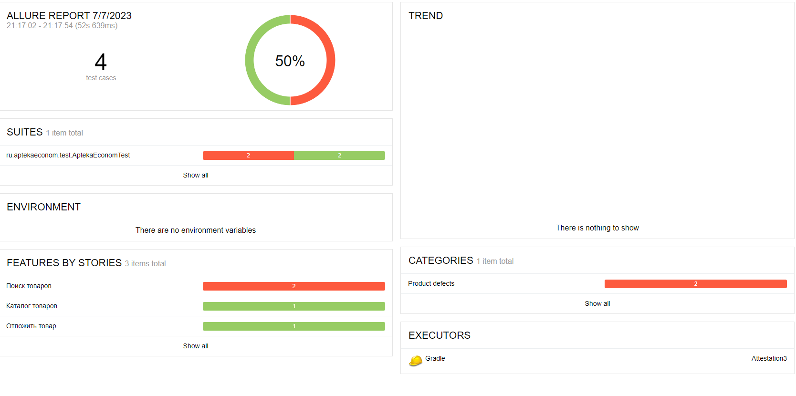
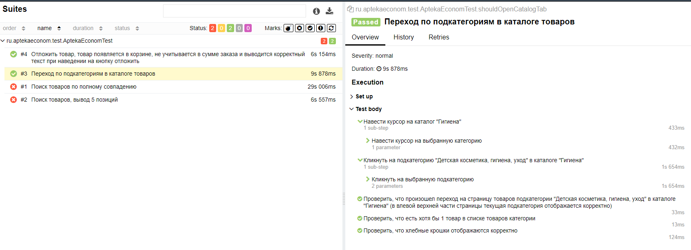
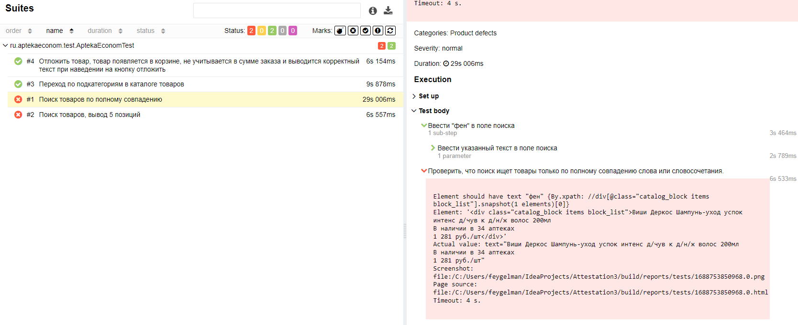
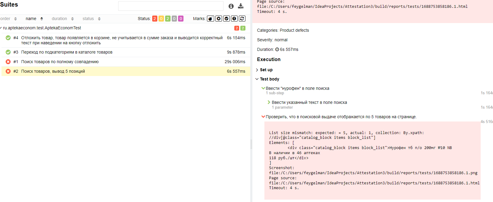
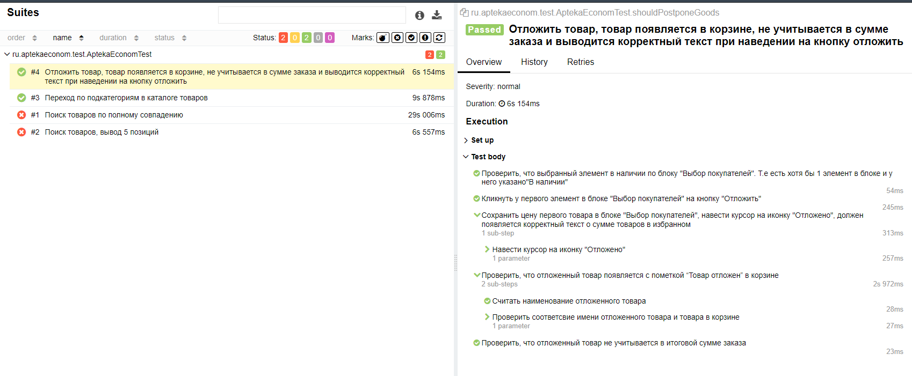

## Мои задачи
### 1. Тест 1 - Каталог
   При переходе в любую подкатегорию каталога, открывается страница хотя бы с 1 товаром в списке товаров категории.
   Хлебные крошки отображаются корректно, в каталогах в левой и верхней части страницы текущая подкатегория
   отображается корректно  
### 2. Тест 2 - Поиск
   Поиск ищет товары только по полному совпадению слова или словосочетания. В поисковой выдаче отображается по 5
   товаров на странице
### 3. Тест 3 - Отложить
   Товар, который есть в наличии можно отложить, нажав на кнопку с иконкой сердечка и текстом “Отложить” на
   карточке товара. Отложенный товар появляется с пометкой “Товар отложен” в корзине, перейти в которую можно по
   кнопке в шапке. При наведении курсора на эту кнопку появляется корректный текст о сумме товаров в избранном.
   Отложенный товар не учитывается в итоговой сумме заказа

## Аллюр отчет

### 1. Тест 1 - Каталог

### 2. Тест 2 - Поиск

### 3. Тест 3 - Отложить
